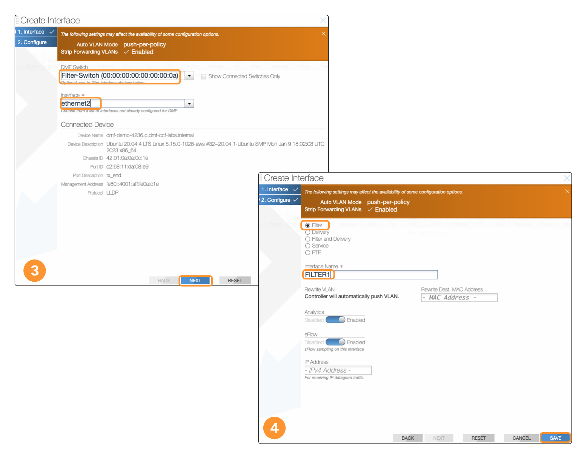
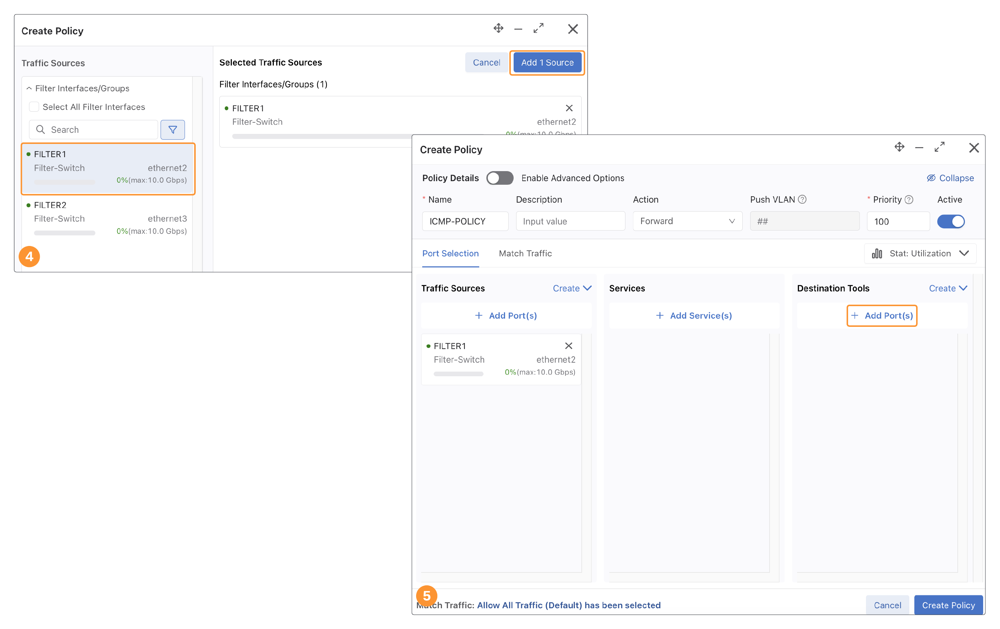
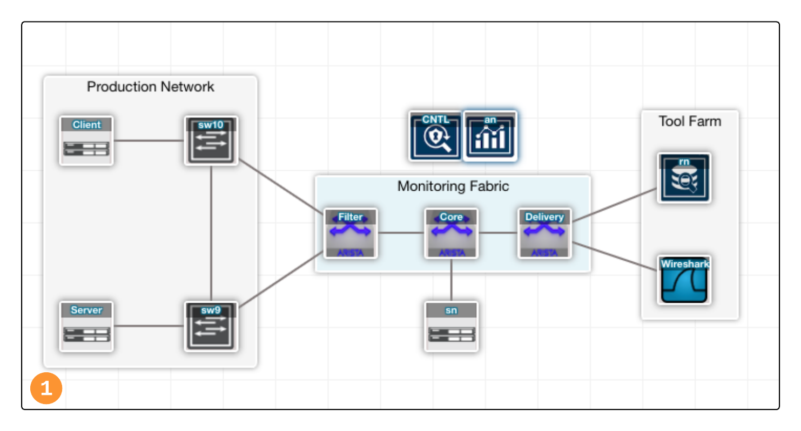
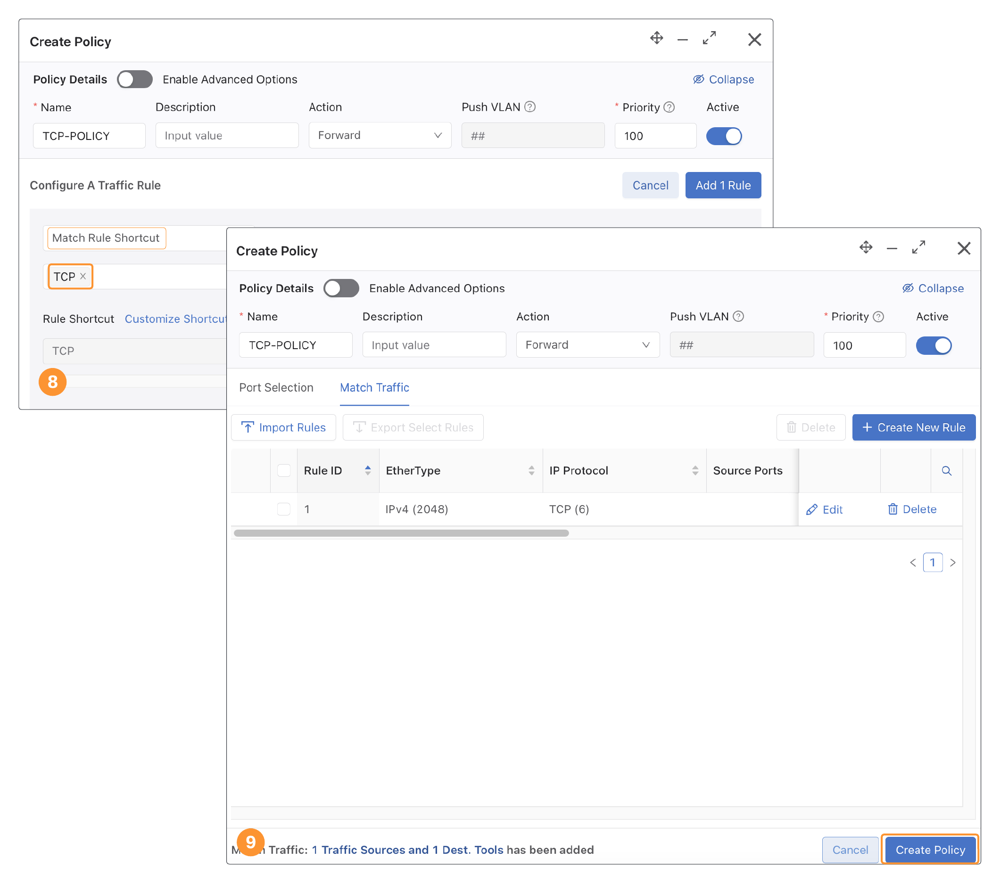
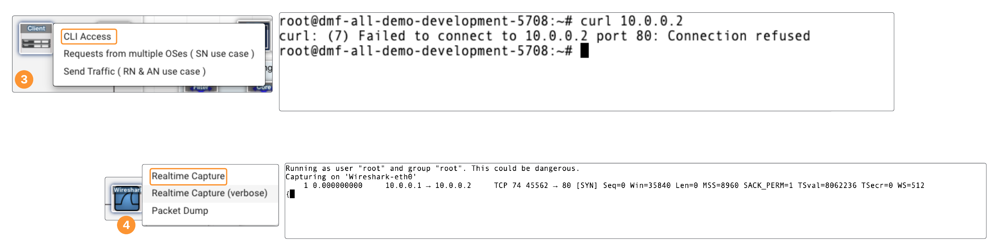
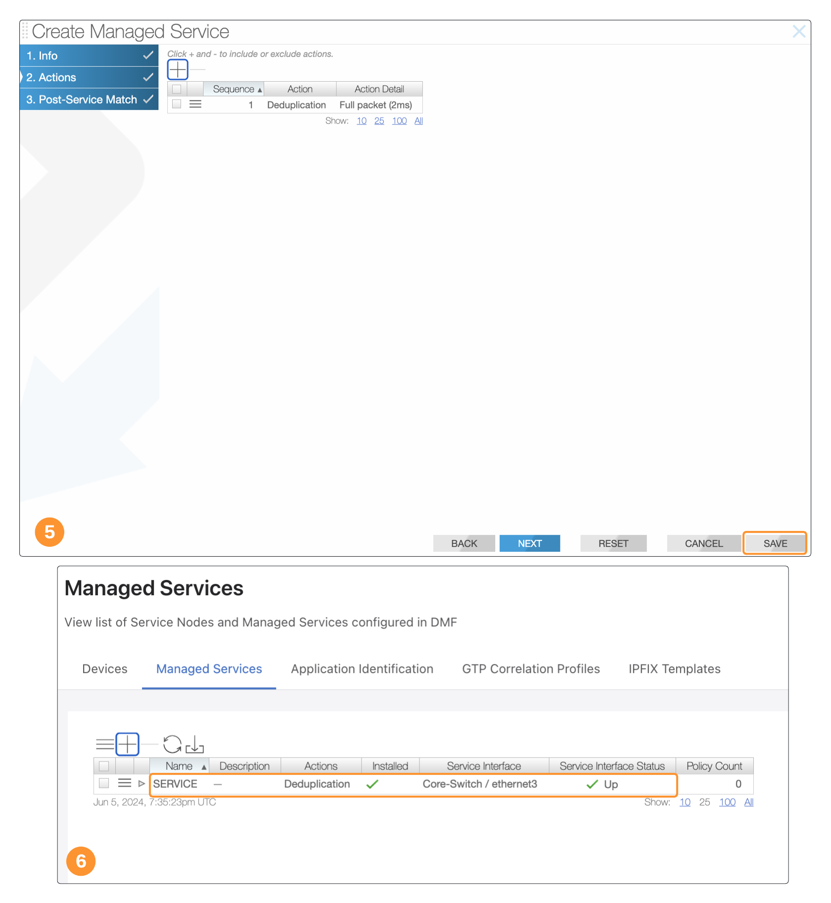
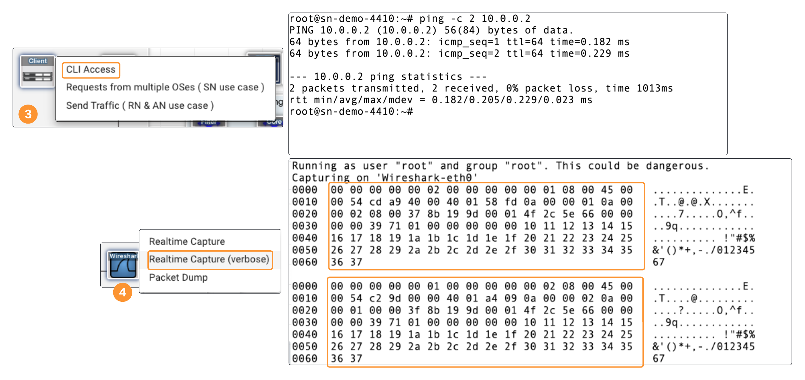

# DANZ Monitoring Fabric(DMF) Lab
---
# Introduction
## Introduction
This Lab will assist you in the configuration and setup of a DMF Fabric, Policies, and Service Node functionality.

## Access the Lab

The image displayed in conjunction with the lab guides is the interactive portions of this lab. The portions of the lab that are interactive are highlighed in the image below. To view the available options displayed click one of the 3 device. 

- **Controller Node**
  - **Controller GUI (Interactive GUI)** - This is where the majority of the Lab will be spent
  - **CLI Access** - You can view the CLI configuration that is applied with the GUI
- **Client**
  - **CLI Access** - LINUX CLI used to generate traffic in the network
  - **Request from multiple OSes** - Places traffic on the network emulating http requests from multiple sources and operating systems
- **Wireshark**
  - **Realtime Capture** - Displays a simple packet capture without full details
  - **Realitime Capture** (verbose) - More detailed capture of packet details
  - **Packet Dump** - full packet capture 
- **Analytics Node** - Left clicking on the Analytics node icon will open a new tab to access the Analytics Node UI.

Selecting any of those options will open a new tab for access to the selected User Interface

## Controller Login
Select the Controller GUI

<!--Need new login page -->

Username: **admin**

Password: **anrn_labs@2024**

---
# Building the DMF Fabric

## Device Roles
Although not a requirement in a DMF design, there are typically 3 roles that network devices have. A single device could accomplish all 3 roles in small enough deployment.

1. **Filter Switch** - This switch(es) will be the connection point from the production network and recieves the monitored traffc 
2. **Delivery Switch** - This switch(es) delivers the traffic that has been passed through DMF to the destination tools.
2. **Core Switch** - In large deployments these devices will aggregate connection from multiple Filter/Delivery switches.

## Add The Filter Switch
The topology that was shown above has been physically connected. We are now going to configure the switches with their respective roles in the topology. All of this configuration will be done on the **DMF Controller.**

After logging in to the controller.

1. **Navigate to Fabric > Switches**
2. Click **+** to provision a switch**
3. Configure the Filter Switch 
   - Name: **Filter-Switch**
   - MAC Address: **00:00:00:00:00:0A** 
   - Leave the rest default and select **Save**

## Verify Fabric Switch 
After saving the configuration the switch should be displayed in a table. If the newly configured switch is showing an **X** under Connected (as shown below), select the **Refresh** Button until you see a **Check Mark**. If selecting refresh does not resolve the issue, revisit the previous section to verify your configuration.

## Add Core and Delivery Switches
**Under Fabric > Switches, repeat the same steps as the filter switch to add the core and delivery switches**
1. **Core-Switch 00:00:00:00:00:0B**
2. **Delivery-Switch 00:00:00:00:00:0C**

## Review Fabric Topology 

Leaf switches (filter & delivery) are not directly connected to each other. On the other hand, a spine switch (core) is a switch that is physically connected to every leaf switch, and if there were multiple core switches, they would not connect to each other.

Click **Fabric** to show a graphical summary of your fabric

_Note: you can select the slider on the left under **Switch Labels** over to **Show** to display the labels as shown in the image below._

Select any of the 3 switches displayed in the **Fabric Topology** to view additional information of each switch.

## Assign Filter Role to Interfaces
Now that we added the switches to the DMF controller, we now need to configure the interfaces on those switches and assign them a role.

_In this lab’s topology ethernet2 and ethernet3 of the Filter-Switch are destination SPAN ports connected to the Production network_

## FILTER1 Interface
1.  Navigate to  **Monitoring > Interfaces**
2.  Click  **+** to add an interface
3.  Switch and Interface
    * DMF Switch: **Filter-Switch**  
    * Interface: **ethernet2**
    * Click **Next**
4.  Interface Configuration
    * Select **Filter** radial button
    * Interface Name: **FILTER1**
    * Click **Save** to apply the configuration

    

## FILTER2 Interface
1.  Click  **+** to add an interface
2.  Switch and Interface
    * DMF Switch: **Filter-Switch**  
    * Interface: **ethernet3**
    * Click **Next**
3.  Interface Configuration
    * Select **Filter** readial button
    * Interface Name: **FILTER2**
    * Click **Save** to apply the configuration

_Note: To highlight the scale-out fabric design, the topology used in this module depicts Filter Ports to be configured on the Filter Switch, Delivery Ports to be configured on the Delivery Switch. This is not a design requirement. A leaf switch of the fabric can be configured with a mix of filter & delivery ports_
## Delivery Interface

Ethernet2 on the Delivery-Switch is physically connected to a Wireshark tool, 

1.  Click  **+** to add an interface
2.  Switch and Interface
    * DMF Switch: **Delivery-Switch**  
    * Interface: **ethernet2**
    * Click **Next**
3.  Interface Configuration
    * Select **Delivery** readial button
    * Interface Name: **WIRESHARK**
    * Click **Save** to apply the configuration

    

## Verify Interface State
Verify the status of all interfaces are showing **Up**. Select the Reresh button if they are not. If **State** does not show **Up** return to the previous steps to review the configuration.

## Client Tools
Now that we have fabric configured in the Controller. Let's review the tools and connectivity. 

Return to the **interactive topology** and select **Wireshark**. Select **Realtime Capture**

Now select Client on the interactive topology and then select **CLI Access**

You will be presented with Linux terminal in a new tab in your browser.

From the Client CLI run the following command **ping -c 2 10.0.0.2**

Navigate to the previously opened  **Wireshark** tab. You should see **NO** additional data in that window as we have yet to configure the traffic to be delivered. This will be done in the next step.

# Creating a Policy
At this point the interfaces have been configured with their proper roles. The next step is to configure a rule that will take the traffic from the SPAN sessions and send it on to the tools. This is done under **Policies**.

## 1st Policy Part1
As demonstrated in previous steps, the packets are not yet being sent to the tools. Lets configure our first policy to send the traffic to Wireshark.

This policy is going to limit the traffic delivered to only include ICMP traffic between 2 hosts. Setting source and/or destination traffic rules can greatly reduce the traffic arriving at your tools and can save resources and scale on those monitoring tools.

Return to the **DMF Controller**

1. Click on **Monitoring > Policies**
2. Click on the **+ Create Policy** button
3. Under Name fill in **ICMP-Policy** and select **+Add Port(s)**

## 1st Policy Part2
We are only going to configure a single FILTER interface with this policy. The additional interfaces will be used in later labs.

4. Select the **FILTER1** interface. Click **Add 1 Source**
   * *We will configure a second FILTER interface later in the lab*
5. Under Desintation Tools Click **+ Add Port(s)**
6. Select the **WIRESHARK** interface. Click **Add 1 interface**

## 1st Policy Part3

7. Select **Match Traffic**. 
8. Click **Configure A Rule**
9. Creat Rule
    * Under the first dropdown Select *Custom Rule**. 
    * EtherType: **IPv4 (2048)**
    * IP Protocol: **ICMP (1)**
    * Source IP Adddress: **Range**
    * Minimum: **10.0.0.1**
    * Maximum: **10.0.0.2**
    * Click **Add 1 Rule**
10. Select **Create Policy**

## Verify 1st Policy
Verify the policy is showing as **active** and **installed** by hovering over **ICMP-POLICY**

## Test 1st Policy
Now the that **ICMP POLICY** has been created, lets verify that we are seeing traffic. 

_Note: If you kept the windows for both Wireshark and the Client CLI open, you can skip to **#3**_ 

1. Return to the Interactive Lab topology
2. Click on the **Wireshark** icon and select **Realtime Capure**
3. Click on the **Client** icon and select **CLI**
   * Run **ping -c 2 10.0.0.2**
4. Return to the Wireshark **Realtime Capture**
<!-- New Policy test 1 page --->

*You should see 4 lines in the Wireshark Capture 2 ICMP requests and 2 ICMP replies.*

---
# Create The Second Policy

## 2nd Policy Part 1

Goal: Add a second policy for one tool **(Wireshark)** to monitor TCP traffic in addition to the ICMP.

This policy is going to capture all TCP traffic collected. 

1. Click on the **+ Create Policy** button
2. Create Policy
    * Name:  **TCP-POLICY**  
    * Under **Traffic Sources** select **+Add Port(s)**
3. Add FILTER Ports
    * Select **FILTER1** interface. 
    * Click **Add 1 Source**
4. Under **Desintation Tools** Click **+ Add Port(s)**
5. Destination Tools
    * Select the **WIRESHARK** interface. 
    * Click **Add 1 interfaces**

## 2nd Policy Part 2
**Creating the 2nd Policy (Continued)**

6. Select **Match Traffic**. 
7. Click **Configure A Rule**
8. Configure Rule
    * In the first dropdown Select **Match Rule Shortcut**
    * In the second dropdown Select **TCP**
    * Click **Add 1 Rule**
9. Select **Create Policy**

## Test 2nd Policy
Now the that **TCP POLICY** has been created, lets verify that we are seeing traffic. 

*Note: If you kept the windows for both Wireshark and the Client CLI open, you can skip to **#3** 

1. Return to the Interactive Lab topology
2. Click on the **Wireshark** icon and select **Realtime Capure**
3. Click on the **Client** icon and select **CLI**
   * Run **curl 10.0.0.2**
   * *Note: connection will fail, but you will see the TCP packet*
4. Return to the Wireshark **Realtime Capture**

---
# DMF Service Node

## Add Service Node
The Service Node provides the advanced packet analysis features to the DMF fabric. Before we are able demonstrate those advanced functions we need to add the Service Node to the DMF fabric.

1. Navigate to **Fabric** > **Connected Devices**
2. Annotate the **Chassis ID** of **serivce-node-850**
3. Navigate to **Monitoring** > **Managed Services**
4. Under **Devices** select the **+** to Add device
5. Fill in the annotated information from step 1
   - Name: **Service-Node**
   - MAC Address: **42:01:0a:0a:0c:28**
   - Select **Submit**

## Verify Service Node 

After configuring the Service Node verify that the DMF controller is able to communicate with the Service Node

1. If the IP Address, Serial Number, Int Count, Interfaces are blank select the **Refresh Button**
2. If the DMF controller is able to communicate with the Serivce Node that information should populate.

---
# Deduplication

## Create Deduplication Service
Deduplication provides the ability to detect a duplicates of a packet. Allowing only the first instance of the packet and dropping other iterations of the same packet. 

1. Add Managed Service
   * Select the **Managed Services** tab
   * Click the **+** to create a new service
2. Create Managed Service
    * name: **SERVICE**
    * Switch: **Core-Switch**
    * Interface: **ethernet3**
    * Select **Next**
3. Select the **+** to add a servie
4. Configure Managed Service
    * Sequence **1** [default]
    * Select **Deduplication** from the dropdown
    * Select the **Full Packet** radial button under Packet Handling 
    * Select **Append**
5. Select **Save**
6. Verify the **Installed** and the interface is **Up**

## Generate Duplicate Traffic
Now that we have configured the **Deduplication Service**, we still need to apply it to a policy.

First, lets update an existing policy. In our previous policies we only included a single FILTER interface. We are going to add the second interface to generate duplicate traffic.

1. Navigate to **Monitoring > Policies**
2. Edit **ICMP-POLICY**
   * Select the check mark next to the **ICMP-POLICY**
   * Select **Edit**
3. Under **Traffic Sources** select **+ Add Port(s)**
4. Add Additional FILTER Interface
   * Select the **FILTER2** interface
   * Select **Add 1 Source**
5. Select **Save Policy**

## Test Duplicate Traffic

Now that we have added the **FILTER2** interface to the **ICMP POLICY** we should now see a copy of the traffic as it traverses both switches.

*Note: If you kept the windows for both Wireshark and the Client CLI open, you can skip to **#3** 

1. Return to the Interactive Lab topology
2. Click on the **Wireshark** icon and select **Realtime Capure**
3. Click on the **Client** icon and select **CLI**
   * Run **ping -c 2 10.0.0.2**
4. Return to the Wireshark **Realtime Capture**

*If you recall when we intially created the **ICMP-POLICY** we only capture 2 ICMP reqests and 2 ICMP replies. By adding the 2nd interface we are now capturing those packets twice*
   
## Apply Deduplication
Now that we are generating duplicate traffic, lets apply the **Deduplication Service** to the policy.

1. One again edit **ICMP-POLICY**
   * Select the check mark next to the **ICMP-POLICY**
   * Select **Edit**
2. Select **+ Add Service(s)**
3. Select **Add Service**
4. Add Service
   * Service Type: **Managed Service**
   * Service: **SERVICE**
   * Select **Add 1 Service**
5. Select **Save Policy**

## Verify Deduplication Service
We have now applied the **Deduplication** service to the policy. In our previous check, we were seeing duplicate ICMP traffic sent to wirehsark. We are not going to verify that the **Deduplication** service is in place.

*Note: If you kept the windows for both Wireshark and the Client CLI open, you can skip to **#3** 

1. Return to the Interactive Lab topology
2. Click on the **Wireshark** icon and select **Realtime Capure**
3. Click on the **Client** icon and select **CLI**
   * Run **ping -c 2 10.0.0.2**
4. Return to the Wireshark **Realtime Capture**

*You should now see 4 lines in the Wireshark Capture 2 ICMP requests and 2 ICMP replies.*

---
# Slicing 

## Slicing
Slicing provides the ability to slice a packet to reduce/remove data that is sent to your tools. 

The goal in this lab is to only retain the MAC, IP header and the 8 byte ICMP payload of the echo request packet

## Review Before Slicing
Lets review the traffic prior to creating a Slicing service.

*Note: We will be using a different Wireshark output for the slicing portion of the lab* 

1. Return to the Interactive Lab topology
2. Click on the **Wireshark** icon and select **Realtime Capure (verbose)**
3. Click on the **Client** icon and select **CLI**
   * Run **ping -c 2 10.0.0.2**
4. Return to the Wireshark **Realtime Capture**

*Note the 98 Bytes in the packet*

## Packet Slicing Service
We are now going to include the packet slicing service in conjuction with the previously configured deduplication service.

1. Navigate to **Monitoring > Managed Services**
2. Select the **Managed Services** tab
3. Select the 3 lines next to the service and Select **Edit**
4. Click on **2. Actions**
5. Select the **+** to add another service
6. Creat the **Slice** Action
   - Sequence: **2**
   - Action: Locate **Slice** from the dropdown
   - Anchor: Locate **L4 Header Start** from the dropdown
   - Offset: **8**
   - Select **Append**
7. Select **Save**

*Since the service is already applied to the **ICMP POLICY** there is no need to update the policies*

## Verify Slicing
Now that we have configured our Slicing Service, lets verify that are slicing the packets.

*Note: We will be using a different Wireshark output for the slicing portion of the lab

If you kept the windows for both Wireshark and the Client CLI open, you can skip to **#3** * 

1. Return to the Interactive Lab topology
2. Click on the **Wireshark** icon and select **Realtime Capture (verbose)** 
   - This will give us a view of the packet size
   - Nothing is output but traffic received will be captured when seen
3. Click on the **Client** icon, and select ***CLI
Access***
   - Run the follwoing command **ping -c 1 10.0.0.2**
4. Return to the Wireshark **Realtime Capture(verbose)** to review the output

---
# Pattern Matching

## Pattern Matching
DMF service node pattern matching enables payload content based filtering

## Test Pre Pattern Match

Before we configure the **Pattern Match** service, lets review what the output looks like prior to applying the service.

*Note: The **Pattern Matching** portion of the lab will be using a different Wireshark output*

1. Return to the Interactive Lab topology
2. Click on the **Wireshark** icon and select **Realtime Packet Dump** 
   - This will provide a full packet dump of traffic seen by Wireshark
   - Nothing should output but traffic received will be captured when seen *(If you are seeing ICMP request from open CLI windows in previous steps, stop those sessions)*
3. Click on the **Client** icon and select **Requests from multipe OSes**
4. Return to the Wireshark **Packet Dump**
   * Review the output
   * In the window use **Ctrl+F / Command+F** to find all instances of **User-Agent** (Note the number of instances and the different Operating Systems found)

   

## Pattern Matching Service
Creating the pattern matching service

Goal: modify service to match packets containing the pattern " Windows NT 5.[0-1]", in order to Windows NT machines

We will use the existing configured Managed Service to create the **Pattern Matching** Service.

1. Navigate to **Monitoring > Managed Services**
2. Select the **Managed Services** tab
3. Select the 3 lines next to the service and Select **Edit**
4. Click on **2. Actions**
5. Delete the existing services
   * Select the Radial Button for each installed Service
   * Click the **-**
6. Select the **+** to Add a Managed Service
7. Create the **Pattern Match** Service
   * Sequence: **1**
   * Action: Select **Pattern Match** from the dropdown
   * Pattern: **Windows NT 5.[0-1]**
   * Select **Append**
   * Select **Save**

## Add Pattern Match to TCP Policy
We are going to apply the Pattern Match Service to the pre-existing TCP Policy.

From the Controller UI.
1. If not already on the policy page navigate to **Monitoring > Policies**
2. Select the check mark next to **TCP-POLICY** and select **Edit**
3. Select **+ Add Service(s)**
4. Select **Add Service**
5. Select the Service
   * Service Type: **Managed Service**
   * Service: **SERVICE**
   * Select **Add 1 Service**
6. Select **Save Policy**

## Test Pattern Matching
Close the existing **Wireshark Packet Dump** if still open.

1. Return to the Interactive Lab topology
2. Click on the **Wireshark** icon and select **Realtime Packet Dump)** 
3. Click on the **Client** icon and select **Requests from multipe OSes**
4. Return to the Wireshark **Packet Dump**
   * Review the output
   * In the window use **Ctrl+F / Command+F** to find all instances of **User-Agent** (Note the number of instances has been reduced and the only operating system displayed should be Windows NT 5.0/5.1)

Note: To view the controller configuration, login to the CLI with admin/sn_labs@2024 and run the command show running-config from the CLI.

